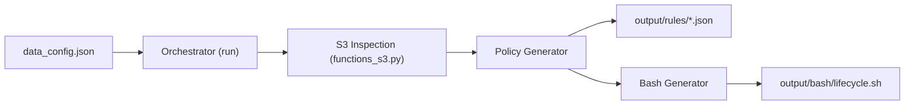

# 🚀 S3 Lifecycle Policy Generation Toolkit

Automate the **discovery**, **policy generation**, and **deployment** of AWS S3 lifecycle configurations for your data lake buckets. This toolkit reads a JSON configuration, inspects S3 prefixes, creates precise lifecycle rules (excluding certain folders), and bundles everything with a ready-to-run bash script for easy application.

---

## 📚 Table of Contents

1. [Project Overview](#project-overview)
2. [How It Works](#how-it-works)
   - [Architecture](#architecture)
   - [Data Flow](#data-flow)
3. [Configuration](#configuration)
4. [Usage](#usage)
5. [Modules & Files](#modules--files)
6. [Testing](#testing)
7. [Dependencies](#dependencies)
8. [Output](#output)
9. [License](#license)

---

## 📝 Project Overview

This project provides a robust, automated solution for managing AWS S3 lifecycle policies at scale. It:

- **Discovers** valid data prefixes in S3 buckets
- **Generates** JSON lifecycle policy files with custom rules (including delta log exclusion)
- **Creates** a bash script for batch deployment via AWS CLI

The main components are orchestrated from a single configuration file, ensuring repeatable and reliable S3 policy management.

---

## ⚙️ How It Works

### Architecture

The following diagram illustrates the major components and their interactions:

### Data Flow



---

## 🛠️ Configuration

Edit `resources/data_config.json` to define which buckets, prefixes, and lifecycle timing rules to use. Example:

```json
[
  {
    "name": "my-bucket",
    "prefix": "data",
    "days_to_glacier": 100,
    "days_to_deep_archive": 200,
    "days_to_expiration": 299,
    "paths_to_ignore": ["test"]
  }
]
```

- **name**: S3 bucket name
- **prefix**: Data prefix to target
- **days_to_glacier**: Days before transition to GLACIER storage
- **days_to_deep_archive**: Days before transition to DEEP_ARCHIVE storage
- **days_to_expiration**: Days before permanent deletion
- **paths_to_ignore**: Folder paths to exclude from lifecycle actions

---

## 🚀 Usage

1. **Install dependencies**
   ```bash
   pip install -r requirements.txt
   ```
2. **Configure your buckets and rules**
   - Edit `resources/data_config.json` as shown above.
3. **Run the orchestrator**
   ```bash
   python main.py
   ```
   - This will create JSON policy files in `output/rules/` and a bash script in `output/bash/lifecycle.sh`.
4. **Apply the policies**
   ```bash
   bash output/bash/lifecycle.sh
   ```
   - The script uses AWS CLI to apply each lifecycle policy to its respective bucket.

---

## 📂 Modules & Files

| File/Module                                   | Purpose                                                                          |
|-----------------------------------------------|----------------------------------------------------------------------------------|
| `files/__init__.py`                          | Marks the `files/` directory as a Python package (empty)                         |
| [`files/bash_generate.py`](#filesbash_generatepy)      | Builds a bash script to apply lifecycle policies using AWS CLI commands           |
| [`files/functions_s3.py`](#filesfunctions_s3py)        | Discovers valid S3 prefixes/paths for policy application                         |
| [`files/orchestrator.py`](#filesorchestratorpy)        | Main workflow: loads config, coordinates policy and script generation             |
| [`files/polices_generator.py`](#filespolices_generatorpy) | Generates lifecycle policy JSONs for each configuration entry                     |
| `output/rules/`                               | Stores generated JSON lifecycle policy files per bucket                          |
| `output/bash/lifecycle.sh`                    | The generated bash script for batch applying all lifecycle policies               |
| `resources/data_config.json`                  | The main configuration file (edit this to control which buckets/rules to manage)  |
| `main.py`                                    | Project entry point (runs the orchestrator)                                      |
| `requirements.txt`                           | Python dependencies                                                              |
| `tests/`                                     | Pytest test suite for core logic                                                 |

---

### files/bash_generate.py

Generates the bash script by:

- Scanning `output/rules/` for JSON files
- For each, appending an AWS CLI command block to `output/bash/lifecycle.sh`
- Ensures the script applies the correct policy to the correct bucket

### files/functions_s3.py

Discovers valid "base paths" in S3 that match expected patterns (e.g., have both `_delta_log/` and `year=YYYY/` subfolders), ensuring policies are not blindly applied but targeted only at meaningful data partitions.

### files/orchestrator.py

Central controller that:

- Prepares output directories
- Loads config
- For each config item:
  - Calls the policy generator
- Invokes the bash script generator at the end

### files/polices_generator.py

For each configuration entry, this:

- Discovers valid lifecycle paths (using functions_s3)
- Generates rules, including:
  - Exclusion rules for delta log folders (very long expiration)
  - Standard transition/expiration rules for main paths
- Writes the final JSON

---

## 🧪 Testing

- Run all tests with:
  ```bash
  pytest
  ```
- Test modules validate:
  - Bash script content and generation logic
  - Policy generator output and structure

---

## 📦 Dependencies

- **pytest**: For testing
- **boto3**: For AWS S3 prefix discovery

Install with:
```bash
pip install -r requirements.txt
```

---

## 🗃 Output

- **JSON policies**: In `output/rules/`, e.g., `my-bucket.json`
- **Bash script**: In `output/bash/lifecycle.sh`

Sample JSON policy:
```json
{
  "Rules": [
    {
      "ID": "ExcludeDeltaLog-data-test",
      "Filter": {"Prefix": "data/test/_delta_log/"},
      "Status": "Enabled",
      "Expiration": {"Days": 9999}
    },
    {
      "ID": "Default-Transition-Policy",
      "Filter": {"Prefix": "data"},
      "Status": "Enabled",
      "Transitions": [
        {"Days": 100, "StorageClass": "GLACIER"},
        {"Days": 200, "StorageClass": "DEEP_ARCHIVE"}
      ],
      "Expiration": {"Days": 299}
    }
  ]
}
```

---

## 📝 License

MIT License. See `LICENSE` file for details.

---

**Automate your S3 lifecycle management. Ensure compliance. Save storage costs!**